# Práctica Docker 🐳

## EJ1
Responde a las siguientes cuestiones, adjuntando una o varias capturas de pantalla para demostrar la validez de tu respuesta.

### 1. ¿Cómo sabemos cuál es la versión de Docker que tenemos instalada?
Para conocer la versión de docker instalada podemos usar el comando `docker --version`.

 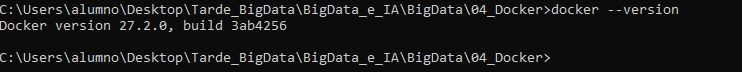

### 2. ¿Cuántos contenedores hay funcionando en tu PC?
Para saber cuando contenedores tenemos funcionando en nuestro PC podemos usar ``docker ps`` o ``docker ps -a``
si queremos saber tambien los que están inactivos.

 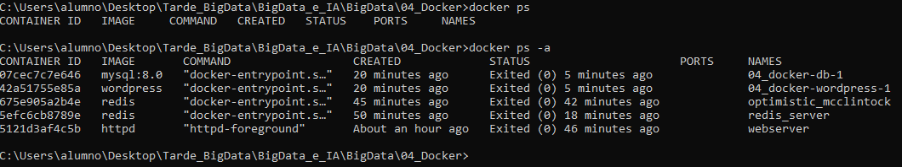

### 3. Pon a funcionar un contenedor usando la imagen de Debian.
Para poner a funcionar un contenedor usando la imagen de Debian simplemente tenemos que poner ``docker run debian`` esto nos descargará y pondrá en funcionamiento el contenedor.

 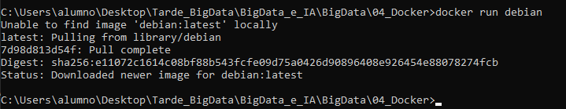

Sin embargo el contenedor de Debian se cierra automaticamente a menos que tenga algún tipo de proceso activo
por eso usaremos el comando ``docker run -it debian`` para instantaneamente conectados a la terminal bash de Debian.

 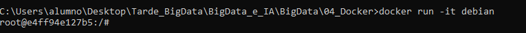

Ahora ya podemos ver nuestro contenedor en funcionamiento ya sea usando ``docker ps`` o por Docker desktop.

  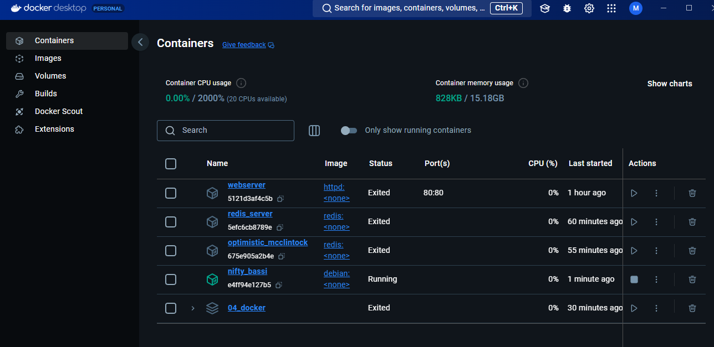

### 4. Detén el contenedor que has creado.
Si queremos detener un contenedor activo como por ejemplo el de debian tendremos que usar el comando `docker stop <id contenedor debian>`, recuerda que para saber el id del contenedor puedes usar ``docker ps``

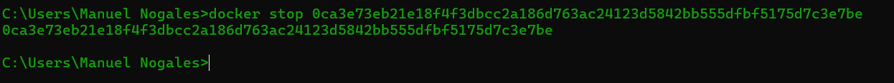

### 5. Elimina el contenedor que has creado.
Finalmente si queremos eliminar un contenedor simplemente tendremos que usar el comando `docker rm <id contenedor debian>`

 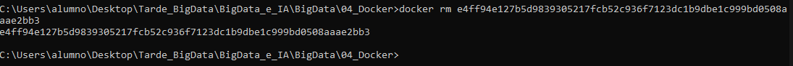

## EJ2
Crea un contenedor Debian, accede a él desde dos puntos simultáneamente, luego ejecuta un comando sobre él, deténlo y elimínalo. Usa los comandos: `create`, `start`, `attach`, `exec`, `stop` y `rm`.

- Nombre el contenedor como "test1" con la opción `--name`.
- Publica esta imagen en tu DockerHub.

Adjunta una o varias capturas de pantalla para demostrar la validez de tu respuesta y el enlace a tu imagen en DockerHub.

Para realizar este ejercicio tenemos dos formas, la primera usando dos terminales de forma que una mantenga un proceso activo y la otra realice los comandos necesarios o usando `tail -f dev/null` con una única terminal

### tail -f dev/null
Este comando mantendrá el contenedor activo y en ejecución sin hacer nada (tail -f monitorea /dev/null, que es un dispositivo vacío en Linux). 

 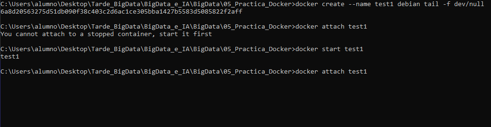

### dos terminales
En una primera terminal iniciaremos el contenedor llamado test1 de debian e iniciaremos el bash

 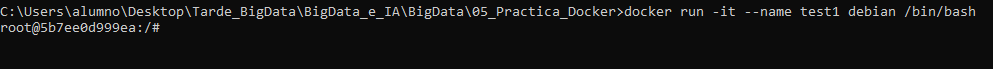

ahora desde otra terminal podremos hacer el resto de comandos como exec stop o rm
 
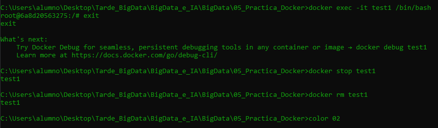

### publicar en docker hub nuestro contenedor
Para publicar en docker hub nuestro contenedor primero tenemos que hacer login en docker con el siguiente comando ``docker login -u usuario -p contraseña`` aunque -u y -p ya no es recomendado, generalmente con docker login es suficiente.
Tras esto en caso de que hayamos hecho algún cambio a nuestro contenedor guardaremos nuestros cambios haciendo un commit con el siguiente comando ``docker commit <container_id> nombre_de_usuario/nueva_imagen:tag``

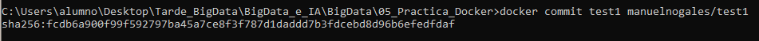

finalmente haremos push de nuestro contenedor a docker hub con el siguiente comando ``docker push usuario_dockerhub/nombre_del_repositorio:tag``

[Enlace Docker Hub](https://hub.docker.com/repository/docker/manuelnogales/test1/general)

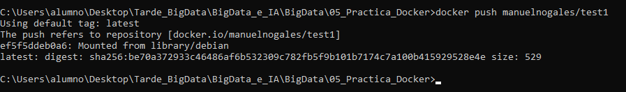

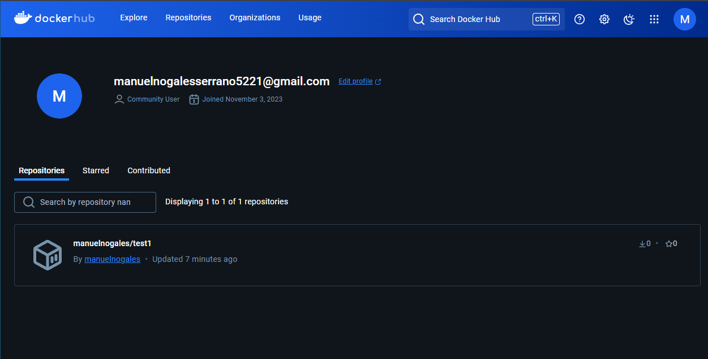


## P1 Crear un back-end de gestión de BBDD con phpMyAdmin y MySQL.
`docker-compose -f ddbb_myadmin_compose.yml up`

``` yml
services:
  MariaDB:
    image: mariadb:10.3
    restart: always
    environment:
      MYSQL_ROOT_PASSWORD: 1234

  phpmyadmin:
    image: phpmyadmin
    restart: always
    ports:
      - 8080:80
    environment:
      PMA_HOST: MariaDB
      PMA_ARBITRARY: 1
```

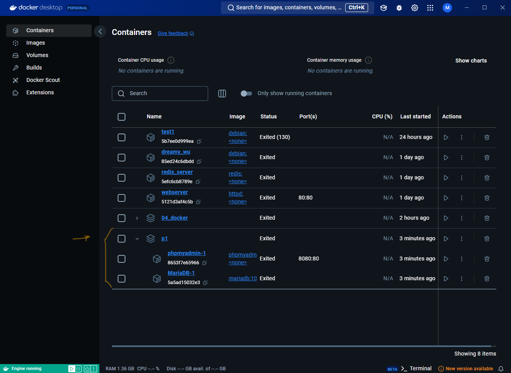
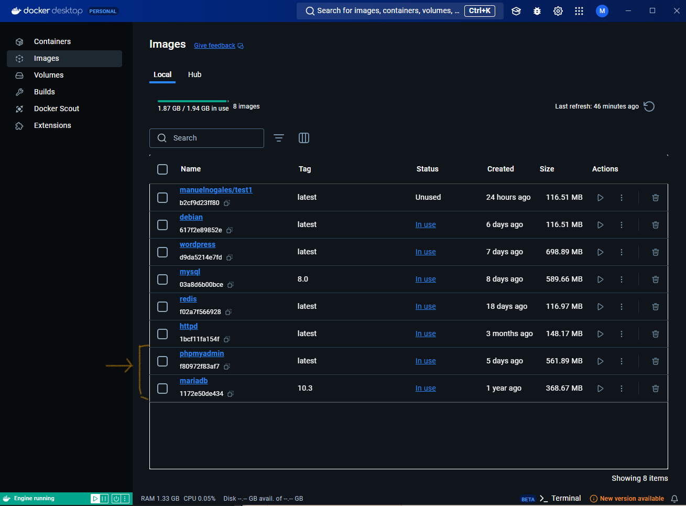
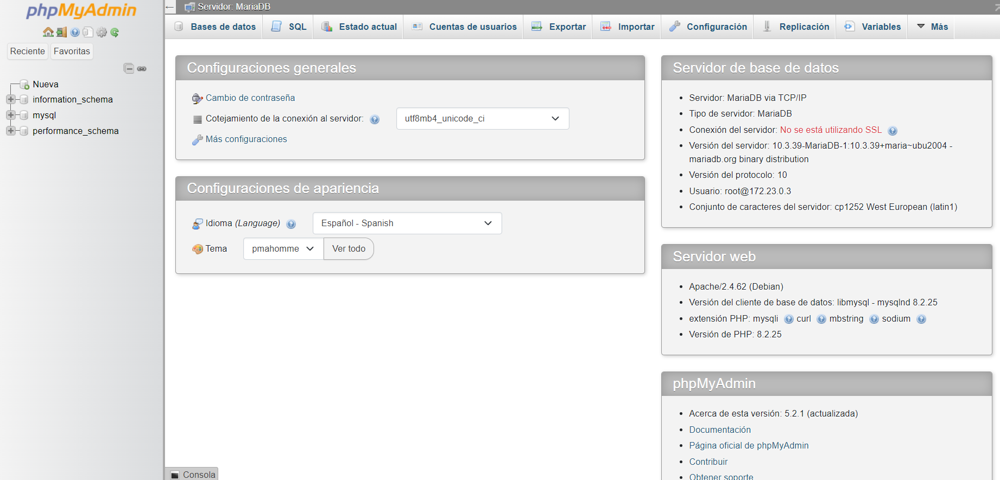

## P2 Crear las pilas (X)AMP y (X)EMP para despliegue de proyectos web

 ### XAMP
```yml
services:
  apache:
    image: php:8.0-apache
    ports:
      - "8080:80"
    volumes:
      - ./src:/var/www/html
    environment:
      APACHE_DOCUMENT_ROOT: /var/www/html
    depends_on:
      - mysql
    command: /bin/bash -c "docker-php-ext-install mysqli && apache2-foreground"

  mysql:
    image: mysql:8.0
    environment:
      MYSQL_ROOT_PASSWORD: root
      MYSQL_DATABASE: mydb
      MYSQL_USER: user
      MYSQL_PASSWORD: userpass
    ports:
      - "3306:3306"

  phpmyadmin:
    image: phpmyadmin/phpmyadmin
    ports:
      - "8081:80"
    environment:
      PMA_HOST: mysql
      MYSQL_ROOT_PASSWORD: root
```

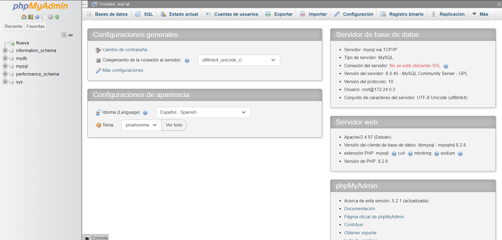
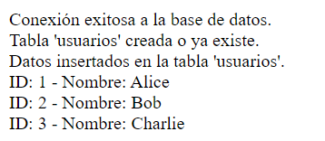

 ### XEMP
 Por alguna razón el servidor no reconoce index.php como index, por lo que tenemos que entrar en [localhost/index.php](http://localhost:8080/index.php)

 ```yml
 services:
  nginx:
    image: nginx:latest
    ports:
      - "8080:80"
    volumes:
      - ./src:/usr/share/nginx/html
      - ./nginx.conf:/etc/nginx/conf.d/default.conf

  mysql:
    image: mysql:8.0
    environment:
      MYSQL_ROOT_PASSWORD: root
      MYSQL_DATABASE: mydb
      MYSQL_USER: user
      MYSQL_PASSWORD: userpass
    ports:
      - "3306:3306"

  phpmyadmin:
    image: phpmyadmin/phpmyadmin
    ports:
      - "8081:80"
    environment:
      PMA_HOST: mysql
      PMA_USER: user
      PMA_PASSWORD: userpass

  php:
    build:
      context: .
    volumes:
      - ./src:/var/www/html
 ```
 ```nginx.conf
     server {
        listen 80;
        server_name localhost;

        root /var/www/html;
        index index.php;

        location / {
            try_files $uri $uri/ =404;
        }

        location ~ \.php$ {
            include fastcgi_params;
            fastcgi_pass php:9000;
            fastcgi_index index.php;
            fastcgi_param SCRIPT_FILENAME $document_root$fastcgi_script_name;
        }

        location ~ /\.ht {
            deny all;
        }
    }
 ```
 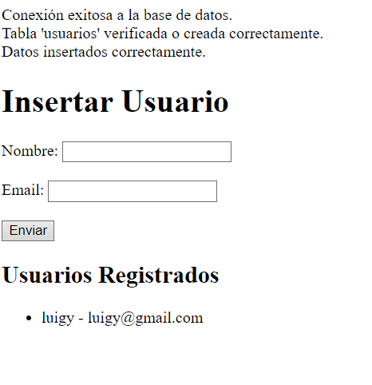
 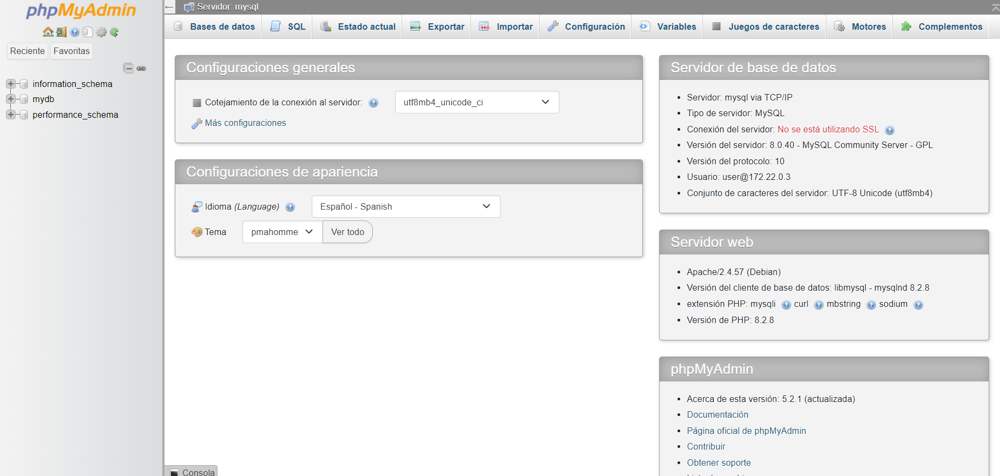

 ### XEMP 2.0
 version extra usando la imagen nginx:alpine que si que reconoce index.php como index

## P3 Crear un servidor Tomcat con MySQL-phpMyAdmin para despliegue de aplicaciones web con Java.
esto es lo que conseguido por mi cuenta, obviamente podría haber copiado el repositorio de  [Seetha1231](https://github.com/Seetha1231/docker-httpd-tomcat-mysql/tree/master)

```yml
services:
  tomcat:
    image: tomcat:9.0
    container_name: tomcat
    ports:
      - "8080:8080"
    volumes:
      - ./webapps:/usr/local/tomcat/webapps
    environment:
      - MYSQL_HOST=mysql
      - MYSQL_PORT=3306
      - MYSQL_DATABASE=testdb
      - MYSQL_USER=root
      - MYSQL_PASSWORD=secret
    depends_on:
      - mysql
    networks:
      - app-network

  mysql:
    image: mysql:8.0
    container_name: mysql
    restart: always
    environment:
      MYSQL_ROOT_PASSWORD: secret
      MYSQL_DATABASE: testdb
    ports:
      - "3306:3306"
    networks:
      - app-network

  phpmyadmin:
    image: phpmyadmin/phpmyadmin
    container_name: phpmyadmin
    environment:
      PMA_HOST: mysql
      MYSQL_ROOT_PASSWORD: secret
    ports:
      - "8081:80"
    depends_on:
      - mysql
    networks:
      - app-network

networks:
  app-network:
    driver: bridge
```
 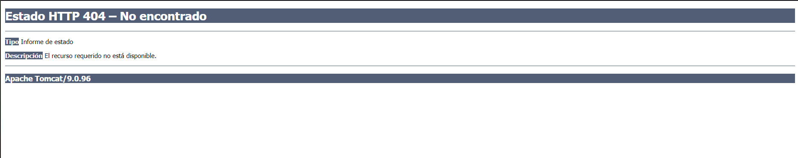
 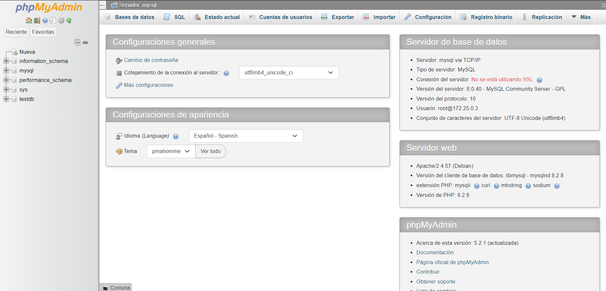