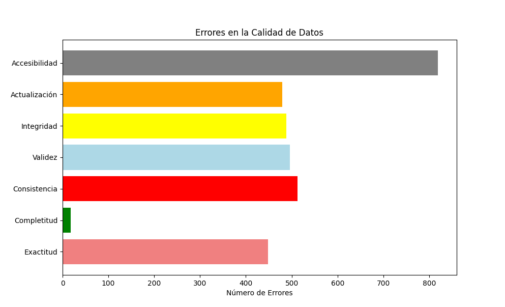
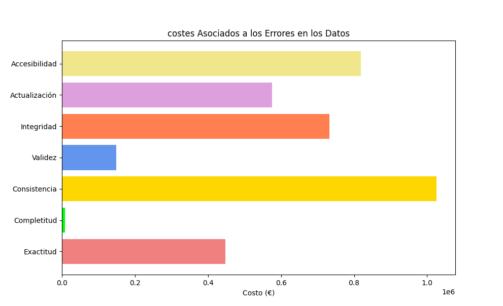

# Calidad y costes

## Índice
- [Estructura de los datos a estudiar](#estructura-de-los-datos-a-estudiar)
- [Definición tipos de errores](#Definición-de-tipos-de-errores)
- [Busqueda de errores](#Busqueda-de-errores)
- [Resultados](#Resultados)
- [Gráficas con matplotlib](#Gráficas-con-matplotlib)

## Estructura de los datos a estudiar 

| ID Cliente | Nombre | Dirección | Correo Electrónico | Teléfono | Última Actualización (días) | Pedido Válido | Tiempo Acceso (seg) |
|------------|--------|-----------|---------------------|----------|----------------------------|---------------|---------------------|

tambien podemos usar los metodos de pandas .info() para conocer las columnas y los datos NaN y Null o .head()

## Definición de tipos de errores

### Exactitud
La exactitud puede medirse comparando los datos observados con los datos verdaderos o correctos si estos están disponibles.
### Completitud
La completitud se mide como la proporción de datos presentes en comparación con el total esperado. Calculamos el porcentaje de registros  que tienen todos los campos obligatorios completados.
### Consistencia
Para la consistencia o consistencia, se puede utilizar una métrica que compare la cantidad de valores consistentes frente al total de valores.
### Validez
La conformidad comprueba la validez de los datos, es decir, el formato de estos, se puede medir como la proporción de datos que cumplen con un conjunto de reglas definidas.
### Integridad
La integridad se asegura de que todos los datos estén vinculados a de forma válida. La integridad puede ser medida por la proporción de registros que cumplen con todas las reglas de integridad referencial, foreign keys, documentos embebidos, etc.
### Actualización
La actualización se mide por el tiempo de actualiación de los datos,1 dia,15 dias...
### Accesibilidad
La accesibilidad se mide por el tiempo promedio de respuesta para acceder a los datos.

## Busqueda de errores
Para iniciar la busqueda de errores lo primero que haremos será crear copias de seguridad de nuestro dataframe original, de forma que podamos usarlos sin preocuparnos de modificarlos
```
accuracy = df.copy()
completeness = df.copy()
consistency = df.copy()
validity = df.copy()
integrity = df.copy()
actualization = df.copy()
accessibility = df.copy()
```
### Exactitud
```
#identificar registros con errores en el campo nombre o dirección
accuracy_errors_df = accuracy[(accuracy['Nombre'].str.len() < 3) | (accuracy['Dirección'].str.len() < 3) | accuracy['Nombre'].isna() | accuracy['Dirección'].isna()]

print("Errores de exactitud",accuracy_errors_df.shape[0])
```
### Completitud
```
# numero de errores en total de las tres columnas, en una fila puede haber entre 0 y 3 errores
# completeness_errors = completeness[['Nombre', 'Dirección', 'Correo Electrónico']].isna().sum().sum()

# si los datos de todas las columnas son erroneos contarlo como un error
completeness_errors = completeness[completeness['Nombre'].isna() & completeness['Dirección'].isna() & completeness['Correo Electrónico'].isna()].shape[0

print("Errores de completitud: ", completeness_errors)
```
### Consistencia
```
    # formato correcto "+34 123456789"
    regex_telephone = r'^\+34 \d{9}$'
    telephone_errors = consistency[~df['Teléfono'].str.contains(regex_telephone, na=False, regex=True)].shape[0]
```

### Validez
```
# regex que permite emails como "john_doe123@yahoo.co.uk" y "user.name_with-hyphens@domain.co"
email_regex = r'^[a-zA-Z0-9](?:[a-zA-Z0-9._-]*[a-zA-Z0-9])?@[a-zA-Z0-9.-]+\.[a-zA-Z]{2,}$'
email_errors = validity['Correo Electrónico'].apply(lambda x: not bool(re.match(email_regex, x)) if pd.notna(x) else True).sum()

```
### Integridad
```
# error si el campo está vacio, nan o contiene Inválido
integrity_errors = integrity[integrity['Pedido Válido'] != "Válido"].shape[0]
```
### Actualización
```
# error si el tiempo de actualización es superior a 15 dias
actualization_errors = actualization[actualization['Última Actualización (días)'] > 15].shape[0]

```
### Accesibilidad
```
# error si el tiempo de acceso es superior a 0.3 segundos
accessibility_errors = accessibility[accessibility['Tiempo Acceso (seg)'] > 0.3].shape[0]
```
## Resultados
siguiendo la siguiente la tabla de costes por metrica:

### Costes Asociados por Métrica

| **Métrica**       | **Costo por Error (€)** |
|--------------------|-------------------------|
| Exactitud          | 1000                   |
| Completitud        | 500                    |
| Consistencia       | 2000                   |
| Validez            | 300                    |
| Integridad         | 1500                   |
| Actualización      | 1200                   |
| Accesibilidad      | 1000                   |


obtenemos los siguientes costes:

### Desglose de costes
| **Tipo de Error**                   | **Cantidad de Errores** | **Coste Asociado** |
|-------------------------------------|-------------------------|--------------------|
| Errores de exactitud                | 448                     | 448,000€          |
| Errores de completitud              | 18                      | 9,000€            |
| Errores de consistencia en teléfonos| 513                     | 1,026,000€        |
| Errores de validez en email         | 496                     | 148,800€          |
| Errores de integridad en pedidos    | 488                     | 732,000€          |
| Errores de actualización            | 479                     | 574,800€          |
| Errores de accesibilidad            | 819                     | 819,000€          |

## Graficas con matplotlib

### Grafica de errores

```
errors = [
    ('Exactitud', accuracy_errors_df.shape[0]),
    ('Completitud', completeness_errors),
    ('Consistencia', telephone_errors),
    ('Validez', email_errors),
    ('Integridad', integrity_errors),
    ('Actualización', actualization_errors),
    ('Accesibilidad', accessibility_errors)
]

error_colors = ['lightcoral', 'green', 'red', 'lightblue', 'yellow', 'orange', 'grey']

# Separar los nombres de los errores y sus valores
error_names, error_values = zip(*errors)

plt.figure(figsize=(10, 6))
plt.barh(error_names, error_values, color=error_colors)
plt.xlabel('Número de Errores')
plt.title('Errores en la Calidad de Datos')
plt.show()
```




### Grafica de costes

```
costs = [
    ('Exactitud', accuracy_cost),
    ('Completitud', completeness_cost),
    ('Consistencia', consistency_cost),
    ('Validez', validity_cost),
    ('Integridad', integrity_cost),
    ('Actualización', actualization_cost),
    ('Accesibilidad', accessibility_cost)
]

cost_colors = ['lightcoral', 'lime', 'gold', 'cornflowerblue', 'coral', 'plum', 'khaki']

# Separar los nombres de los costes y sus valores
cost_names, cost_values = zip(*costs)

plt.figure(figsize=(10, 6))
plt.barh(cost_names, cost_values, color=cost_colors)
plt.xlabel('Costo (€)')
plt.title('costes Asociados a los Errores en los Datos')
plt.show()
```

