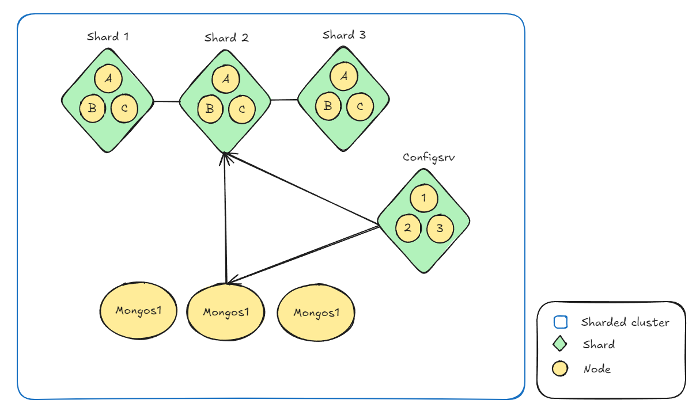
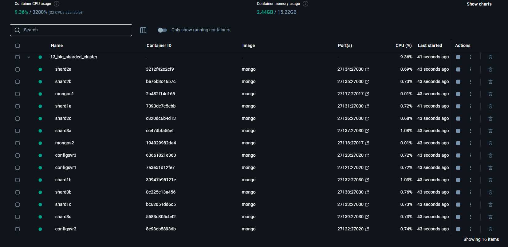
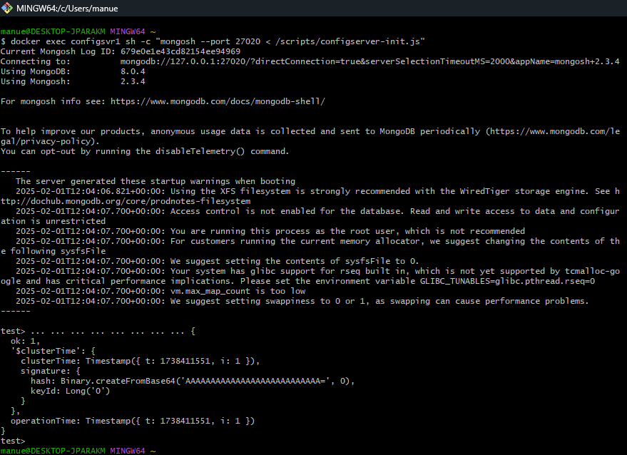
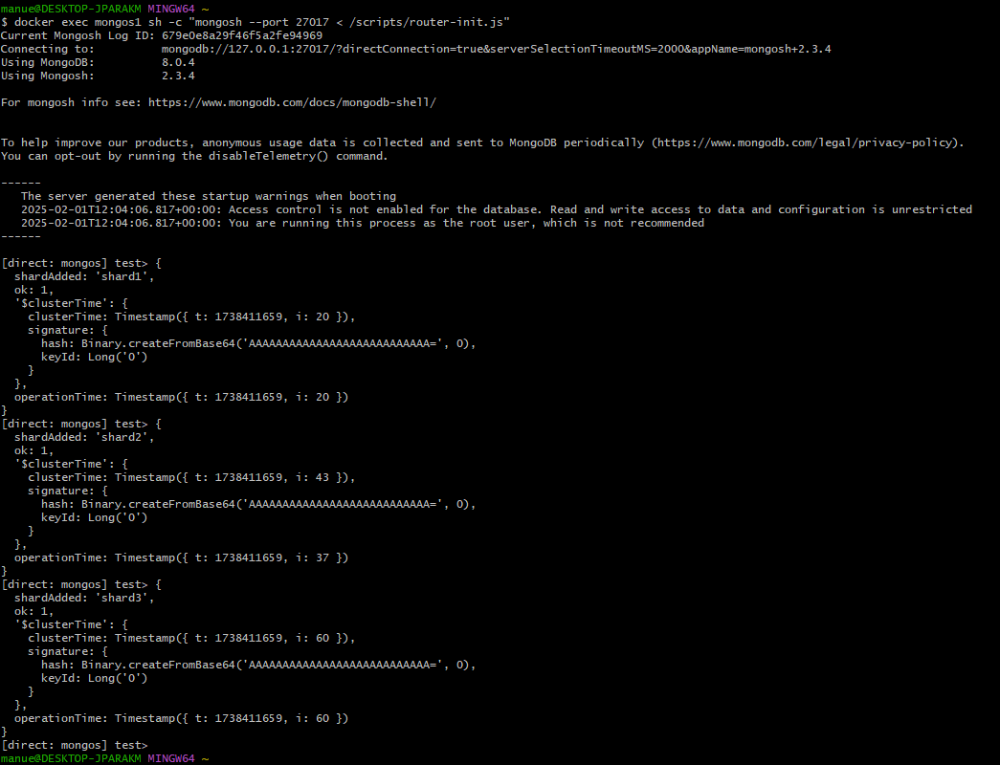
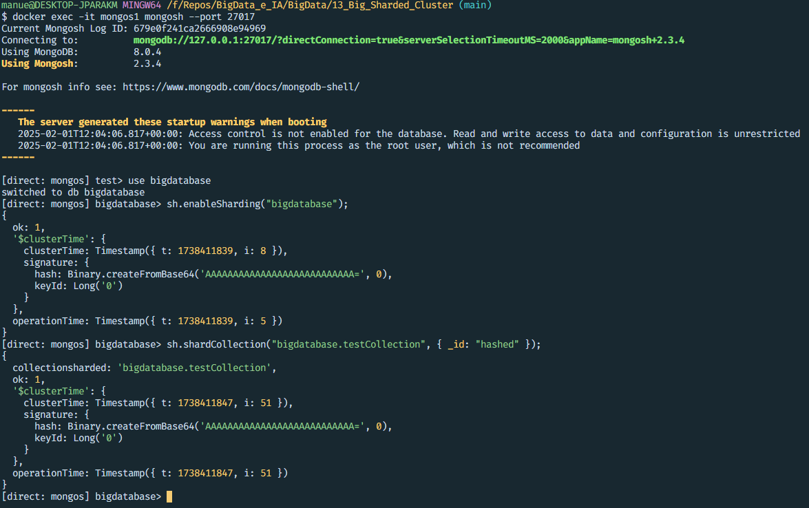
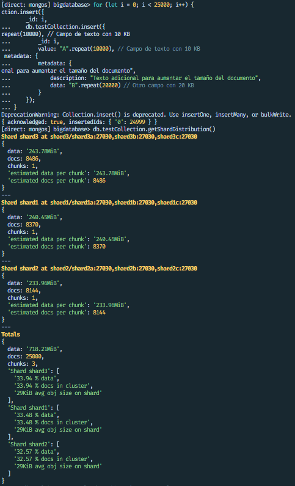

# Deployment of a Sharded Cluster Architecture in MongoDB with Docker - Distributed Data Storage and Management

## Objective
The objective of this activity is to deploy a NoSQL MongoDB database architecture using Docker containers. A scalable and distributed solution will be implemented by configuring:

- A **ReplicaSet of routers (mongos)** to distribute client requests.
- A **ReplicaSet of configuration servers (config server)** to manage cluster metadata.
- A **Sharded Cluster** composed of three ReplicaSets, each with three nodes, for distributed data storage.

Upon completion of the activity, the student will understand how a MongoDB sharded environment works and will be able to deploy it using Docker containers.

---

## Prerequisites
Before starting the activity, ensure you have the following prerequisites:

1. Installation of **Docker** and **Docker Compose** in your working environment.
2. Basic knowledge of **MongoDB** and its sharding architecture.
3. Basic knowledge of configuring environments in **Docker**.

---

## Instructions

### 1. Create the necessary file structure:
- Create a working directory named `mongo-sharded-cluster` or a similar descriptive name.
- Inside the directory, create a `docker-compose.yml` file to define the services.

### 2. Define the services in Docker Compose:
- Configure a service for the **Configuration ReplicaSet (configsvr)** with three nodes.
- Configure a service for the **Router ReplicaSet (mongos)** with three nodes.
- Configure three services for the **Shard ReplicaSets (shard1, shard2, shard3)**, each with three nodes.

### 3. Initialization of the ReplicaSets:
- Access each container and initialize the ReplicaSets using the MongoDB shell (`mongo`).
- Configure the members of each ReplicaSet.

---

## Deliverables
The student must deliver:

1. **`docker-compose.yml` file** with the complete configuration and necessary shell/bash scripts.
2. **Screenshots** showing:
   - The successful initialization of the ReplicaSets.
   - The addition of shards to the router.
   - Querying the database with partitioning applied.
3. **A report** describing:
   - The structure of the deployed cluster.
   - The commands used step-by-step, complemented with screenshots.
   - Chunks, stored collections, and how they are distributed, along with tests using datasets (even if they are numbers).
   - The challenges encountered and how they were resolved.

# Report on the MongoDB Sharded Cluster Deployed with Docker Compose

## Cluster Structure

### Cluster Components
1. **Routers (mongos):**
   - `mongos1`, `mongos2`, `mongos3`: Services acting as routers to direct queries to the appropriate shards.
   - Ports: `27117`, `27118`, `27119` (external) → `27017` (internal).
   - Configuration: Connected to the configuration server replica set (`rs-config-server`).

2. **Config Servers:**
   - `configsvr1`, `configsvr2`, `configsvr3`: Configuration servers storing cluster metadata.
   - Ports: `27121`, `27122`, `27123` (external) → `27020` (internal).
   - Configuration: Replica set named `rs-config-server`.

3. **Shards:**
   - Each shard is a replica set with three nodes (`a`, `b`, `c`).
   - **Shard 1:** `shard1a`, `shard1b`, `shard1c`.
    - Ports: `27131`, `27132`, `27133` (external) → `27030` (internal).
   - **Shard 2:** `shard2a`, `shard2b`, `shard2c`. 
    - Ports: `27134`, `27135`, `27136` (external) → `27030` (internal).
   - **Shard 3:** `shard3a`, `shard3b`, `shard3c`. 
    - Ports: `27137`, `27138`, `27139` (external) → `27030` (internal).

4. **Network:**
   - All services are connected to the Docker network `big_sharded_cluster`.

### Cluster Diagram
Include a diagram illustrating the cluster structure.



---

## Commands Used

This section details the commands used to deploy and configure the MongoDB sharded cluster.

### Step 1: Deploy the Cluster with Docker Compose
```bash
docker-compose -f big_sharded_cluster.yml up
```

### Step 2: Initialize the Config Servers
Connect to one of the configuration servers (e.g., `configsvr1`) and initialize the replica set and its initialization script:
```bash
docker exec configsvr1 sh -c "mongosh --port 27020 < /scripts/configserver-init.js"
```
Initialization script (automatically uploaded in Docker using volumes):
```javascript
rs.initiate({
    _id: "rs-config-server",
    configsvr: true,
    members: [
      { _id: 0, host: "configsvr1:27020" },
      { _id: 1, host: "configsvr2:27020" },
      { _id: 2, host: "configsvr3:27020" }
    ]
  });
```

### Step 3: Initialize the Shards
Connect to each shard and initialize the replica set. For example, for `shard1` and `shard2`:
```bash
docker exec shard1a sh -c "mongosh --port 27030 < /scripts/shard1-init.js"

docker exec shard2a sh -c "mongosh --port 27030 < /scripts/shard2-init.js"
```
Initialization script (automatically uploaded in Docker using volumes):
```javascript
rs.initiate({
    _id: "shard1",
    members: [
      { _id: 0, host: "shard1a:27030" },
      { _id: 1, host: "shard1b:27030" },
      { _id: 2, host: "shard1c:27030" }
    ]
  });
```
Repeat this process for `shard3`.

### Step 4: Add Shards to the Router (mongos)
Connect to one of the routers (e.g., `mongos1`):
```bash
docker exec mongos1 sh -c "mongosh --port 27017 < /scripts/router-init.js"
```
Script to add nodes to the cluster:
```javascript
sh.addShard("shard1/shard1a:27030");
sh.addShard("shard2/shard2a:27030");
sh.addShard("shard3/shard3a:27030");
```

### Screenshots








### Status Check
`sh.status()` provides a report on the status of our sharded cluster
```bash
docker exec -it mongos1 mongosh --port 27017
sh.status()
```
---

## Chunks, Collections, and Data Distribution

This section describes the chunks, collections, and how data is distributed in the cluster.

### Enable Sharding for a Database and Collection
Connect to a router (`mongos`) and enable sharding for a database and collection:
```javascript
use bigdatabase;
sh.enableSharding("bigdatabase");
sh.shardCollection("bigdatabase.testCollection", { _id: "hashed" });
```
In case an error like the following appears, create an index for the id:
*MongoServerError[InvalidOptions]: Please create an index that starts with the proposed shard key before sharding the collection.*

### Data Distribution
- **Chunks:** Data is divided into chunks based on the shard key (`_id` in this case).
- **Shards:** Chunks are distributed among the shards (`shard1`, `shard2`, `shard3`).

### Tests with Datasets
- **Test Dataset:** Insert data into the `bigdatabase` collection.
- **Results:** Verify data distribution among the shards.

```javascript
use bigdatabase;

for (let i = 0; i < 25000; i++) {
    db.testCollection.insert({
        _id: i,
        value: "A".repeat(10000), // Text field with 10 KB
        metadata: {
            description: "Additional text to increase document size",
            data: "B".repeat(20000) // Another field with 20 KB
        }
    });
}
```

Verify distribution:
```javascript
db.testCollection.getShardDistribution()
```
or
```javascript
sh.status()
```
---

## Challenges Encountered and Solutions

This section describes the challenges encountered during the deployment and configuration of the cluster and how they were resolved.

### Challenge 1: Config Server Initialization Issue
- **Description:** The configuration servers were not initializing correctly; the script ports and Docker compose ports did not match.
- **Solution:** Verify that all containers are running and that the Docker network is correctly configured.

### Challenge 2: Errors Adding Shards
- **Description:** Errors occurred when adding shards to the router.
- **Solution:** Ensure that the shards are correctly initialized and that the hostnames are accessible from the router.

### Challenge 3: Flags
- **Description:** Lack of knowledge about the necessary flags to perform the task.
- **Solution:** 
    1. **`--port <XXXX>:`**
        Specifies the port on which the mongos router listens (default MongoDB port).
    2. **`--configdb <replicaSetName/containerName:port>`**
        Specifies the configuration server replica set (rs-config-server) and its member.
    3. **`--configsvr`**
        Enables config server mode.
    4. **`--bind_ip_all`**
        Binds the mongos process to all available IP addresses, allowing connections from any network interface.
    5. **`--replSet <name>`**
        Specifies the name of the replica set.
    6. **`--shardsvr`**
        Enables shard server mode.
---

## Conclusion

The MongoDB sharded cluster was successfully deployed using Docker Compose. Tests were conducted with datasets to validate its functionality, and the challenges encountered were satisfactorily resolved.

---

## Annexes

- **Initialization Scripts:** 
    - router-init
        - mongos-init.js
    - shard-init
        - shard1-init.js
        - shard2-init.js
        - shard3-init.js
    - configserver-init.js
- **References:** 
    - https://phoenixnap.com/kb/mongodb-sharding
    - https://medium.com/@yasasvi/mongodb-sharding-with-docker-c8b18bee32eb