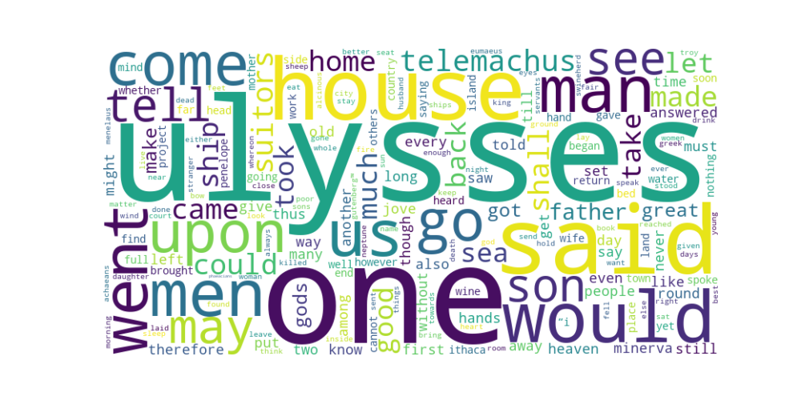

# Análisis de Frecuencia de Palabras y Nube de Palabras

## 1. Introducción
Este informe presenta un análisis de la frecuencia de palabras en el texto *La Odisea* (english version).
El objetivo es procesar el texto, eliminar elementos innecesarios, contar las palabras más frecuentes y generar una representación visual mediante una nube de palabras.

## 2. Metodología

### 2.1 Procesamiento del Texto
- Se convirtieron todos los caracteres a minúsculas.
- Se eliminaron los signos de puntuación.

### 2.2 Tokenización y Eliminación de Palabras Vacías
- El texto se dividió en palabras individuales (Tokenización).
- Se eliminaron las palabras vacías en inglés como "the", "and", "is" utilizando la lista de *stopwords* de NLTK.

### 2.3 Cálculo de Frecuencia de Palabras
- Se realizó un conteo de frecuencia utilizando `collections.Counter`, identificando las palabras más comunes.

### 2.4 Generación de la Nube de Palabras
- Se usaron las palabras más frecuentes para generar una nube de palabras con la librería `wordcloud`.
- La imagen fue guardada como `nube_palabras.png`.

## 3. Resultados

### 3.1 Tabla de Frecuencia de Palabras
| Palabra   | Frecuencia |
|-----------|------------|
|  ulysses  |    582     |
|    one    |    552     |
|    said   |    482     |

### 3.2 Imagen de la Nube de Palabras

## 4. Conclusión
- Las palabras más frecuentes reflejan los temas principales de *La Odisea*.
- Se eliminaron con éxito las palabras vacías para resaltar términos significativos.
- La nube de palabras proporciona una visualización intuitiva de la distribución de las palabras en el texto.