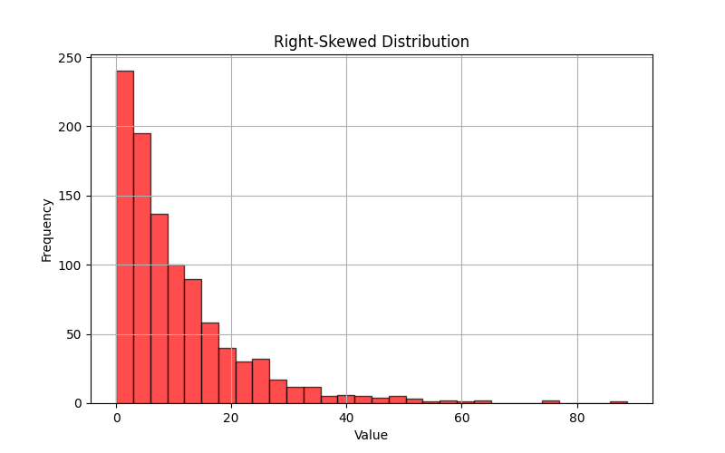

# Diference between **MinMaxScaler** and **StandardScaler**

## **1. MinMaxScaler (Normalization)**
- **Scales the data to a fixed range**, typically **0 to 1**.
- **Formula:**
  \[
  X' = \frac{X - X_{\text{min}}}{X_{\text{max}} - X_{\text{min}}}
  \]
  - \(X\) = original value  
  - \(X_{\text{min}}\) = minimum value in the feature  
  - \(X_{\text{max}}\) = maximum value in the feature  
- **Effect:** The smallest value becomes **0**, the largest value becomes **1**, and all other values are proportionally adjusted.  

### **Example:**
```python
from sklearn.preprocessing import MinMaxScaler
import numpy as np

data = np.array([[10], [20], [30], [40], [50]])

scaler = MinMaxScaler()
scaled_data = scaler.fit_transform(data)

print(scaled_data)
```
**Output:**
```
[[0.  ]
 [0.25]
 [0.5 ]
 [0.75]
 [1.  ]]
```
📌 **Use When:** You want to **preserve the shape** of the data distribution but scale it to a fixed range (e.g., for neural networks).

---

## **2. StandardScaler (Standardization)**
- **Transforms data to have a mean of 0 and a standard deviation of 1** (z-score normalization).
- **Formula:**
  \[
  X' = \frac{X - \mu}{\sigma}
  \]
  - \(X\) = original value  
  - \(\mu\) = mean of the feature  
  - \(\sigma\) = standard deviation of the feature  
- **Effect:**  
  - The distribution remains **the same** but is **centered around 0**.  
  - Values typically fall in the range **-3 to 3** (if the data is normally distributed).  

### **Example:**
```python
from sklearn.preprocessing import StandardScaler
import numpy as np

data = np.array([[10], [20], [30], [40], [50]])

scaler = StandardScaler()
scaled_data = scaler.fit_transform(data)

print(scaled_data)
```
**Output:**
```
[[-1.414]
 [-0.707]
 [ 0.   ]
 [ 0.707]
 [ 1.414]]
```
📌 **Use When:** You need a **normal distribution with zero mean**, especially for algorithms like **Logistic Regression, SVMs, or PCA**, which assume normally distributed data.

---

## **Key Differences**
| Feature          | MinMaxScaler | StandardScaler |
|-----------------|-------------|---------------|
| **Scaling Method** | Rescales to [0,1] (or custom range) | Centers around 0 with std deviation of 1 |
| **Formula** | \(X' = \frac{X - X_{\text{min}}}{X_{\text{max}} - X_{\text{min}}}\) | \(X' = \frac{X - \mu}{\sigma}\) |
| **Effect** | Keeps original distribution shape | Changes distribution to standard normal |
| **When to Use** | When the scale of features matters (e.g., deep learning) | When data needs normal distribution (e.g., SVM, PCA, Logistic Regression) |

---

### **Which one should I use?**
- **Use MinMaxScaler when:**
  - The data **doesn’t follow a normal distribution**.
  - You need values to be in a **fixed range** (e.g., for neural networks).
  
- **Use StandardScaler when:**
  - The data is **normally distributed** or should be **transformed into a normal distribution**.
  - You're using **algorithms that assume normally distributed features** (e.g., Logistic Regression, SVM, PCA).

  # What´s a normal distribution and what´s a non-normal distribution  

1. **A normal distribution (Gaussian distribution)**  
   - This is a **bell-shaped curve** where most values are **centered around the mean**, and fewer values appear at the extremes.  
   - Example: Heights of people, IQ scores, or standardized test scores.  

2. **A non-normal distribution**  
   - This could be **skewed (left or right)**, **uniform**, or **bimodal**.  
   - Example: Income distribution (which is often **right-skewed**, meaning most people earn a low-to-moderate amount, but a few people earn very high salaries).  


Here’s the visualization of both distributions:


1. **Left Plot (Normal Distribution)**:  
   - This is a **bell-shaped curve** where most values are around the mean (~50).  
   - The values **symmetrically** decrease as they move away from the center.  
   - Example: Heights, IQ scores, or standardized test scores.




2. **Right Plot (Non-Normal Distribution - Right-Skewed)**:  
   - Most values are **clustered on the left**, but a few extreme values stretch far to the right.  
   - This is common in **income distribution**, where most people earn a low-to-moderate amount, but a few earn much more.  

### **Why This Matters?**
- **StandardScaler (Z-score normalization)** works best with **normal distributions**.
- **MinMaxScaler (Min-max normalization)** is better when **data is not normally distributed** (e.g., right-skewed data like salaries).
