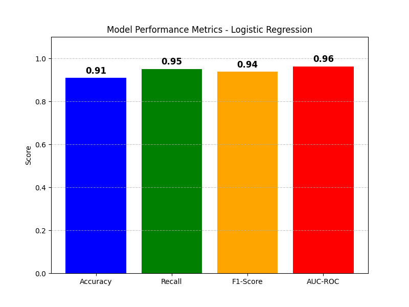
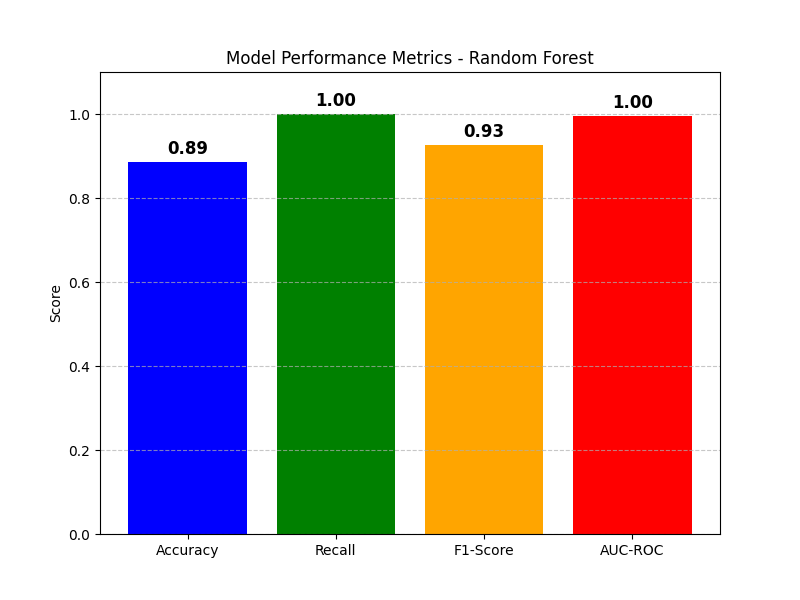

# Clinical Machine Learning Exercise Report  
**Name:** Manuel Nogales Serrano 
**Date:** 02/02/2025 

---

## 1. Problem Analysis  
The goal of this exercise is to predict the presence of heart disease (`enfermedad_cardiaca`) based on a set of clinical features. The dataset includes variables such as age, sex, blood pressure, cholesterol levels, glucose levels, BMI, physical activity, smoking habits, family history, and diabetes status.  

### Dataset Overview  
- **Dataset Name:** `Dataset_Enfermedades.csv`  
- **Features:** `edad`, `sexo`, `presion_sistolica`, `presion_diastolica`, `colesterol`, `glucosa`, `indice_masa_corporal`, `actividad_fisica`, `fumar`, `historia_familiar`, `diabetes`  
- **Target Variable:** `enfermedad_cardiaca` (binary: 0 = no disease, 1 = disease)  

The dataset was split into training (80%) and testing (20%) sets to evaluate the performance of the models.  

```python
# Features:
X = health[['edad','sexo','presion_sistolica','presion_diastolica','colesterol','glucosa','indice_masa_corporal','actividad_fisica','fumar','historia_familiar','diabetes']]
# Target:
y = health['enfermedad_cardiaca']
# Split data into training and test sets
X_train, X_test, y_train, y_test = train_test_split(X, y, test_size=0.2, random_state=42)
```
---

## 2. Models Applied  
The following machine learning models were applied to the dataset:  
1. **Logistic Regression**  
2. **Random Forest**  
3. **Decision Tree**  
4. **Support Vector Machine (SVM)**  

Each model was trained and evaluated using the following metrics:  
- **Accuracy**: Proportion of correctly classified instances.  
- **Recall**: Ability to identify all relevant instances (true positives).  
- **F1-Score**: Harmonic mean of precision and recall.  
- **AUC-ROC**: Area under the ROC curve, measuring the model's ability to distinguish between classes.  

---

## 3. Results and Interpretation  

### 3.1 Logistic Regression  
```python
# Data normalization
scaler = StandardScaler()
X_train = scaler.fit_transform(X_train)
X_test = scaler.transform(X_test)

# Train the logistic regression model
model = LogisticRegression(max_iter=200)
model.fit(X_train, y_train)

# Predictions
y_pred = model.predict(X_test)
y_pred_prob = model.predict_proba(X_test)[:, 1]
```

**Results:**  
- **Accuracy:** 0.91
- **Recall:** 0.95
- **F1-Score:** 0.94
- **AUC-ROC:** 0.96 

**Interpretation:**  
The Logistic Regression model achieved high accuracy (0.91) and recall (0.95), indicating it is effective at predicting heart disease and identifying most positive cases. The F1-Score (0.94) and AUC-ROC (0.96) further confirm its strong performance, suggesting it generalizes well to unseen data. This model is a reliable baseline for this classification task.

---

### 3.2 Random Forest  
```python
# Create the Random Forest model with 100 trees
rf_model = RandomForestClassifier(n_estimators=100, max_depth=5, random_state=42)
rf_model.fit(X_train, y_train)
''' RandomForestClassifier params:
n_estimators=100: indicates the number of trees in the forest (100 in this case).
max_depth=5: Limits the depth of the tree to 5 levels to prevent overfitting.
random_state=42: Ensures reproducibility of the results.
fit(X_train, y_train): Trains the model on the training data.
'''

# predictions
y_pred = rf_model.predict(X_test)
y_pred_prob = rf_model.predict_proba(X_test)[:, 1]
```

**Results:**  
- **Accuracy:** 0.89
- **Recall:** 1.00
- **F1-Score:** 0.93
- **AUC-ROC:** 1.00

**Interpretation:**  
The Random Forest model achieved perfect recall (1.00) and AUC-ROC (1.00), indicating it is excellent at identifying all positive cases and distinguishing between classes. However, its accuracy (0.89) is slightly lower than Logistic Regression, which may be due to overfitting or the model's complexity. Despite this, it remains a robust choice for this problem.

---

### 3.3 Decision Tree  
```python
# Create the Decision Tree model
tree_clf = DecisionTreeClassifier(criterion='gini', max_depth=3, random_state=42)
# example using all the parameters
# tree_clf = DecisionTreeClassifier(
#     criterion='entropy', #gini, entropy
#     max_depth=6,  # Limit the depth of the tree
#     min_samples_split=10,  # Minimum samples required to split a node
#     min_samples_leaf=5,  # Minimum samples required to be at a leaf node
#     class_weight='balanced',  # Handle class imbalance
#     max_features='sqrt',  # Consider only a subset of features at each split
#     random_state=42,  # For reproducibility
#     min_impurity_decrease=0.01,  # Minimum impurity decrease for a split
#     ccp_alpha=0.01  # Prune tree if needed
# )

tree_clf.fit(X_train, y_train)

# Predictions
y_pred = tree_clf.predict(X_test)
y_pred_prob = tree_clf.predict_proba(X_test)[:, 1]
```

**Results:**  
- **Accuracy:** 0.77
- **Recall:** 0.90
- **F1-Score:** 0.85
- **AUC-ROC:** 0.80

**Interpretation:**  
The Decision Tree model achieved moderate accuracy (0.77) and recall (0.90), indicating it can identify most positive cases but struggles with overall precision. The F1-Score (0.85) and AUC-ROC (0.80) suggest it performs reasonably well but is less effective than Logistic Regression and Random Forest. Its simplicity makes it interpretable but may limit its predictive power.

---

### 3.4 Support Vector Machine (SVM)  
```python
# Data normalization
scaler = StandardScaler()
X_train = scaler.fit_transform(X_train)
X_test = scaler.transform(X_test)

# train the SVM model
model = SVC(kernel='rbf', C=1.0, probability=True, gamma='scale',class_weight='balanced')
model.fit(X_train, y_train)
'''
Params:
kernel='rbf': Kernel function used in the algorithm (Radial Basis Function), suitable for non-linear data.
C=1.0: Regularization parameter, controls the trade-off between smooth decision boundary and classifying the training points correctly.
gamma='scale': Controls the influence of a single training point (auto value based on features).
#! probability=True: Enable the probability estimates, needed for AUC-ROC calculation.
'''
# Predictions
y_pred = model.predict(X_test)
y_pred_prob = model.predict_proba(X_test)[:, 1]
```

**Results:**  
- **Accuracy:** 0.91
- **Recall:** 0.91
- **F1-Score:** 0.94
- **AUC-ROC:** 0.97

**Interpretation:**  
The SVM model achieved high accuracy (0.91) and recall (0.91), making it one of the best-performing models. Its F1-Score (0.94) and AUC-ROC (0.97) confirm its strong ability to generalize and distinguish between classes. However, its computational cost may be higher compared to other models, which is a trade-off for its performance.

---

## 4. Model Comparison  
Below is a comparison of the performance metrics for all models:  

| Model               | Accuracy | Recall | F1-Score | AUC-ROC |  
|---------------------|----------|--------|----------|---------|  
| Logistic Regression | 0.91     | 0.95   | 0.94     | 0.96    |  
| Random Forest       | 0.89     | 1.00   | 0.93     | 1.00    |  
| Decision Tree       | 0.77     | 0.90   | 0.85     | 0.80    |  
| SVM                 | 0.91     | 0.91   | 0.94     | 0.97    |  

**Visualization:**  




**Interpretation:**  
The comparison shows that **Logistic Regression** and **SVM** are the best-performing models, with high accuracy, recall, F1-Score, and AUC-ROC. **Random Forest** also performs well, particularly in recall and AUC-ROC, but has slightly lower accuracy. The **Decision Tree** model lags behind in all metrics, likely due to its simplicity and potential for overfitting. Overall, Logistic Regression and SVM are the most reliable choices for this dataset.  

---

## 5. Conclusion  
Based on the analysis, **Logistic Regression** and **SVM** are the most effective models for predicting heart disease in this dataset. Both models achieved high accuracy, recall, and AUC-ROC, demonstrating their ability to generalize well and identify positive cases. **Random Forest** also performed well but may require tuning to improve its accuracy. The **Decision Tree** model, while interpretable, is less effective and may not be suitable for this task without further optimization.  

---

## 6. References  
- Libraries: `pandas`, `matplotlib`, `scikit-learn` 