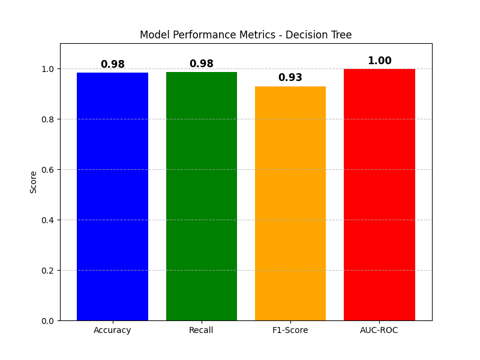

# Clinical Machine Learning Exercise Report
**Name:** Manuel Nogales Serrano
**Date:** 02/02/2025

---

## 1. Problem Analysis

### Dataset Overview
- **Dataset Name:** `Dataset_Academico.csv`
- **Features:** `edad`,`genero`,`horas_estudio`,`asistencia`,`nivel_socioeconomico`,`acceso_internet`,`actividades_extracurriculares`,`estado_emocional`,``nota_promedio_anterior``,``apoyo_familiar``
- **Target Variable:** `rendimiento_academico` (multi target:``Bajo``,``Medio``,``Alto``)

The dataset was split into training (80%) and testing (20%) sets to evaluate the performance of the models.  

```python
mapping = {'Bajo': 1, 'Medio': 2, 'Alto': 3}
academy['rendimiento_academico'] = academy['rendimiento_academico'].map(mapping)
# Features:
X = academy[['edad','genero','horas_estudio','asistencia','nivel_socioeconomico','acceso_internet','actividades_extracurriculares','estado_emocional','nota_promedio_anterior','apoyo_familiar']]
# Target:
y = academy['rendimiento_academico']
# Split data into training and test sets
X_train, X_test, y_train, y_test = train_test_split(X, y, test_size=0.2, random_state=42)
```
---

## 2. Models Applied
The following machine learning models were applied to the dataset:
1. **K-Nearest Neighbors**
2. **Random Forest**
3. **Decision Tree**
4. **Support Vector Machine (SVM)**

Each model was trained and evaluated using the following metrics:  
- **Accuracy**: Proportion of correctly classified instances.  
- **Recall**: Ability to identify all relevant instances (true positives).  
- **F1-Score**: Harmonic mean of precision and recall.  
- **AUC-ROC**: Area under the ROC curve, measuring the model's ability to distinguish between classes.  

---

## 3. Results and Interpretation

### 3.1 K-Nearest Forest
```python
# Data normalization
scaler = MinMaxScaler()
X_train_scaled = scaler.fit_transform(X_train)
X_test_scaled = scaler.transform(X_test)

# train the KNN model with 5 neighbors
knn = KNeighborsClassifier(n_neighbors=5, metric='euclidean')
knn.fit(X_train, y_train)

# Predictions
y_pred = knn.predict(X_test)
y_pred_prob = knn.predict_proba(X_test)
```

**Results:**
- **Accuracy:** 0.94
- **Recall:** 0.88
- **F1-Score:** 0.88
- **AUC-ROC:** 0.99

**Interpretation:**
The KNN model demonstrates strong performance with high accuracy and recall, indicating its ability to correctly classify student performance levels. However, it may struggle with scalability on larger datasets due to its computational intensity.

---

### 3.2 Random Forest
```python
# Create the Random Forest model with 100 trees
rf_model = RandomForestClassifier(n_estimators=100, max_depth=4, random_state=42, class_weight='balanced')
rf_model.fit(X_train, y_train)
# variability of results, max_depth=4 is almost perfect, 5 is perfect using class_weight='balanced'
''' RandomForestClassifier params:
n_estimators=100: indicates the number of trees in the forest (100 in this case).
max_depth=5: Limits the depth of the tree to 5 levels to prevent overfitting.
random_state=42: Ensures reproducibility of the results.
fit(X_train, y_train): Trains the model on the training data.
'''

# Predictions
y_pred = rf_model.predict(X_test)
y_pred_prob = rf_model.predict_proba(X_test)
```

**Results:**  
- **Accuracy:** 0.99
- **Recall:** 0.99
- **F1-Score:** 0.95
- **AUC-ROC:** 1.00

**Interpretation:**
The Random Forest model exhibits outstanding performance across all metrics. With nearly perfect recall and accuracy, it effectively classifies student performance. However, the risk of overfitting must be considered, especially with deeper trees.

---

### 3.3 Decision Tree
```python
tree_clf = DecisionTreeClassifier(criterion='gini', max_depth=4, random_state=42, class_weight='balanced')
# Using max_depth=5 or bigger, the model is "perfect" or overfit

tree_clf.fit(X_train, y_train)

# Predictions
y_pred = tree_clf.predict(X_test)
y_pred_prob = tree_clf.predict_proba(X_test)
```

**Results:**
- **Accuracy:** 0.98
- **Recall:** 0.98
- **F1-Score:** 0.93
- **AUC-ROC:** 1.00

**Interpretation:**
The Decision Tree model performs exceptionally well, closely matching the Random Forest model. While it provides high accuracy and recall, it is prone to overfitting if the depth is not properly controlled.

---

### 3.4 Support Vector Machine (SVM)
```python
# Data normalization
scaler = StandardScaler()
X_train = scaler.fit_transform(X_train)
X_test = scaler.transform(X_test)

# Train the SVM model
model = SVC(kernel='rbf', C=1.0, probability=True, gamma='scale', class_weight='balanced')
model.fit(X_train, y_train)

# Predictions
y_pred = model.predict(X_test)
y_pred_prob = model.predict_proba(X_test)
```

**Results:**
- **Accuracy:** 0.93
- **Recall:** 0.95
- **F1-Score:** 0.88
- **AUC-ROC:** 0.99

**Interpretation:**
The SVM model achieves strong classification performance, particularly in recall and AUC-ROC. It is robust for high-dimensional data but can be computationally expensive compared to tree-based models.


---

## 4. Model Comparison
Below is a comparison of the performance metrics for all models:  

| Model               | Accuracy | Recall | F1-Score | AUC-ROC |  
|---------------------|----------|--------|----------|---------|  
| K-Nearest Neighbors |   0.94   |  0.88  |   0.88   |   0.99  |  
| Random Forest       |   0.99   |  0.99  |   0.95   |   1.00  |  
| Decision Tree       |   0.98   |  0.98  |   0.93   |   1.00  |  
| SVM                 |   0.9 3  |  0.95  |   0.88   |   0.99  |  

**Visualization:**





**Interpretation:**
Random Forest and Decision Tree models performed best, with nearly perfect classification. KNN and SVM also performed well but may require additional tuning for scalability and efficiency.

---

## 5. Conclusion
The Random Forest model emerged as the most effective, striking a balance between accuracy and robustness. Decision Trees performed similarly but require careful depth control. SVM and KNN, while effective, may not scale as efficiently. Future work could explore ensemble methods or deep learning approaches.

---

## 6. References
- Libraries: `pandas`, `matplotlib`, `scikit-learn` 