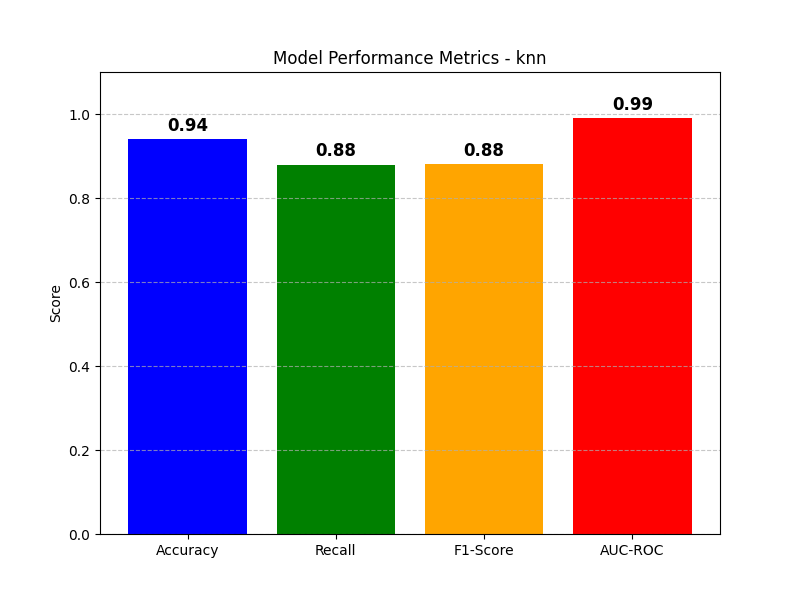
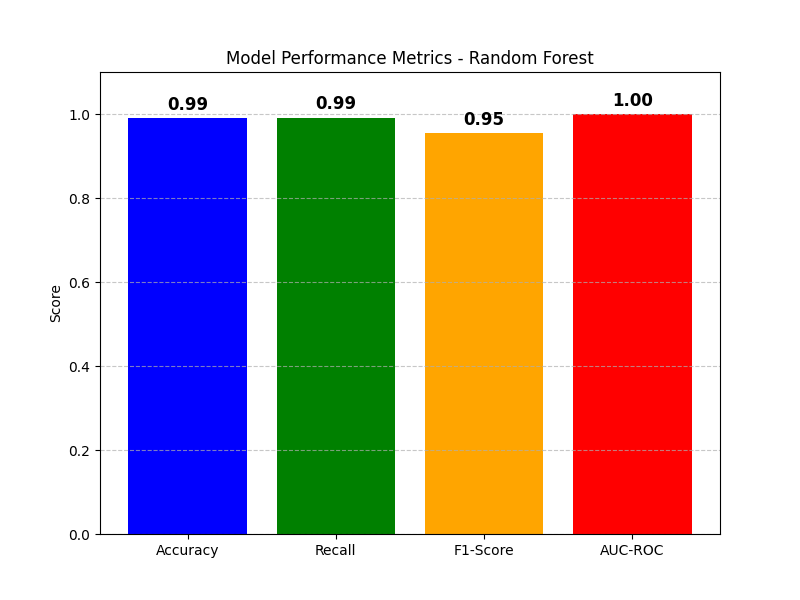
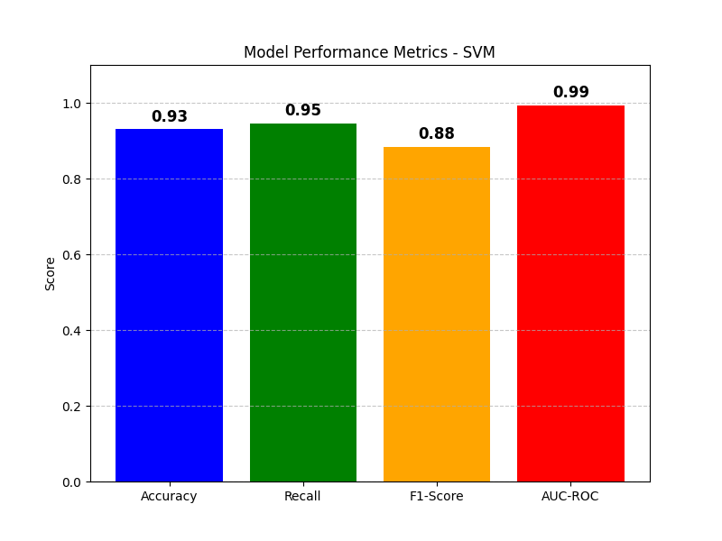
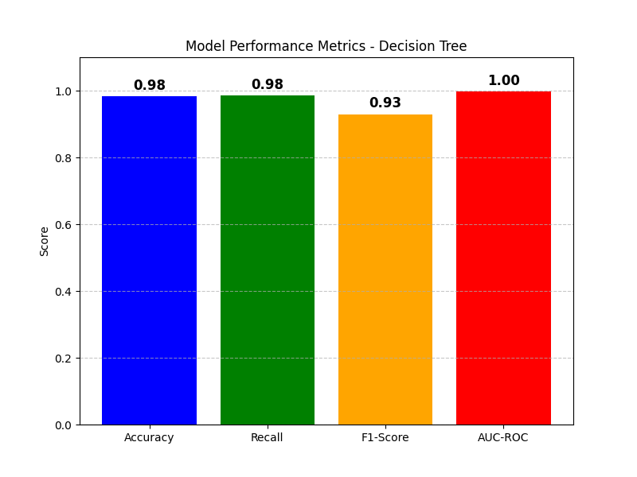

# Informe del ejercicio de Machine Learning 
**Nombre:** Manuel Nogales Serrano  
**Fecha:** 04/02/2025  

---

## 1. Análisis del Problema

### Visión General del Conjunto de Datos  
- **Nombre del Conjunto de Datos:** `Dataset_Academico.csv`  
- **Características:** `edad`, `genero`, `horas_estudio`, `asistencia`, `nivel_socioeconomico`, `acceso_internet`, `actividades_extracurriculares`, `estado_emocional`, `nota_promedio_anterior`, `apoyo_familiar`  
- **Variable Objetivo:** `rendimiento_academico` (multi objetivo: `Bajo`, `Medio`, `Alto`)  

El conjunto de datos se dividió en datos de entrenamiento (80%) y prueba (20%) para evaluar el rendimiento de los modelos.  

```python
mapping = {'Bajo': 1, 'Medio': 2, 'Alto': 3}
academy['rendimiento_academico'] = academy['rendimiento_academico'].map(mapping)
# Features:
X = academy[['edad','genero','horas_estudio','asistencia','nivel_socioeconomico','acceso_internet','actividades_extracurriculares','estado_emocional','nota_promedio_anterior','apoyo_familiar']]
# Target:
y = academy['rendimiento_academico']
# Split data into training and test sets
X_train, X_test, y_train, y_test = train_test_split(X, y, test_size=0.2, random_state=42)
```

---

## 2. Modelos Aplicados  
Se aplicaron los siguientes modelos de aprendizaje automático al conjunto de datos:  
1. **K-Nearest Neighbors**  
2. **Random Forest**  
3. **Decision Tree**  
4. **Support Vector Machine (SVM)**  

Cada modelo fue entrenado y evaluado utilizando las siguientes métricas:  
- **Accuracy**: Proporción de instancias clasificadas correctamente.  
- **Recall**: Capacidad de identificar todas las instancias relevantes (verdaderos positivos).  
- **F1-Score**: Media armónica entre precisión y recall.  
- **AUC-ROC**: Área bajo la curva ROC, midiendo la capacidad del modelo para distinguir entre clases.  

---

## 3. Resultados e Interpretación  

### 3.1 K-Nearest Forest  
```python
# Data normalization
scaler = MinMaxScaler()
X_train_scaled = scaler.fit_transform(X_train)
X_test_scaled = scaler.transform(X_test)

# train the KNN model with 5 neighbors
knn = KNeighborsClassifier(n_neighbors=5, metric='euclidean')
knn.fit(X_train, y_train)

# Predictions
y_pred = knn.predict(X_test)
y_pred_prob = knn.predict_proba(X_test)
```

**Resultados:**  
- **Accuracy:** 0.94  
- **Recall:** 0.88  
- **F1-Score:** 0.88  
- **AUC-ROC:** 0.99  

**Interpretación:**  
El modelo KNN demuestra un alto rendimiento en accuracy y recall, lo que indica su capacidad para clasificar correctamente los niveles de rendimiento de los estudiantes. Sin embargo, puede tener problemas con la escalabilidad en conjuntos de datos más grandes debido a sus altos requisitos computacionales.  

---

### 3.2 Random Forest  
```python
# Create the Random Forest model with 100 trees
rf_model = RandomForestClassifier(n_estimators=100, max_depth=4, random_state=42, class_weight='balanced')
rf_model.fit(X_train, y_train)
# variability of results, max_depth=4 is almost perfect, 5 is perfect using class_weight='balanced'
''' RandomForestClassifier params:
n_estimators=100: indicates the number of trees in the forest (100 in this case).
max_depth=5: Limits the depth of the tree to 5 levels to prevent overfitting.
random_state=42: Ensures reproducibility of the results.
fit(X_train, y_train): Trains the model on the training data.
'''

# predictions
y_pred = rf_model.predict(X_test)
y_pred_prob = rf_model.predict_proba(X_test)
```

**Resultados:**  
- **Accuracy:** 0.99  
- **Recall:** 0.99  
- **F1-Score:** 0.95  
- **AUC-ROC:** 1.00  

**Interpretación:**  
El modelo Random Forest demuestra un rendimiento sobresaliente en todas las métricas. Con una accuracy y recall casi perfectos, clasifica efectivamente el rendimiento de los estudiantes. Sin embargo, se debe considerar el riesgo de overfitting, especialmente con profundidades máximas más altas.  

---

### 3.3 Decision Tree  
```python
tree_clf = DecisionTreeClassifier(criterion='gini', max_depth=4, random_state=42, class_weight='balanced')
# Using max_depth=5 or bigger, the model is "perfect" or overfit

tree_clf.fit(X_train, y_train)

# Predictions
y_pred = tree_clf.predict(X_test)
y_pred_prob = tree_clf.predict_proba(X_test)
```

**Resultados:**  
- **Accuracy:** 0.98  
- **Recall:** 0.98  
- **F1-Score:** 0.93  
- **AUC-ROC:** 1.00  

**Interpretación:**  
El modelo Decision Tree tiene un rendimiento excepcional, similar al modelo de Random Forest. Aunque ofrece alta accuracy y recall, puede estar sujeto a overfitting si la profundidad maxima no se controla adecuadamente.  

---

### 3.4 Support Vector Machine (SVM)  
```python
# Data normalization
scaler = StandardScaler()
X_train = scaler.fit_transform(X_train)
X_test = scaler.transform(X_test)

# Train the SVM model
model = SVC(kernel='rbf', C=1.0, probability=True, gamma='scale', class_weight='balanced')
model.fit(X_train, y_train)

# Predictions
y_pred = model.predict(X_test)
y_pred_prob = model.predict_proba(X_test)
```

**Resultados:**  
- **Accuracy:** 0.93  
- **Recall:** 0.95  
- **F1-Score:** 0.88  
- **AUC-ROC:** 0.99  

**Interpretación:**  
El modelo SVM logra un alto rendimiento, particularmente en recall y AUC-ROC. Es robusto para datos de alta dimensión, pero puede ser computacionalmente costoso en comparación con los modelos basados en árboles.  

---

## 4. Comparación de Modelos  
A continuación se muestra una comparación de las métricas de rendimiento de todos los modelos:  

| Modelo               | Accuracy | Recall | F1-Score | AUC-ROC |  
|---------------------|----------|--------|----------|---------|  
| K-Nearest Neighbors |   0.94   |  0.88  |   0.88   |   0.99  |  
| Random Forest       |   0.99   |  0.99  |   0.95   |   1.00  |  
| Decision Tree       |   0.98   |  0.98  |   0.93   |   1.00  |  
| SVM                 |   0.93   |  0.95  |   0.88   |   0.99  |  

**Visualización:**  
  
  
  
  

**Interpretación:**  
Los modelos Random Forest y Decision Tree tuvieron el mejor rendimiento, con una clasificación casi perfecta. KNN y SVM también tuvieron buenos resultados, pero pueden requerir ajustes adicionales para la escalabilidad y eficiencia.  

---

## 5. Conclusión  
El modelo Random Forest resultó ser el más eficaz, logrando un equilibrio entre precisión y robustez. Decision Tree tuvo un rendimiento similar, pero requiere un control detallado de la profundidad. SVM y KNN, aunque efectivos, pueden no escalar de manera tan eficiente.

---

## 6. Referencias  
- Bibliotecas: `pandas`, `matplotlib`, `scikit-learn`