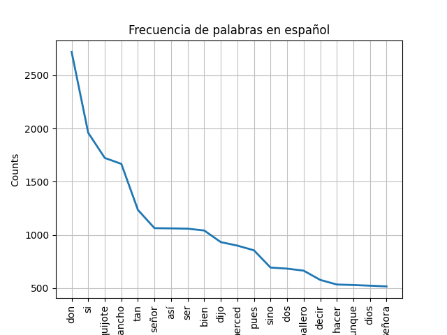

# Procesamiento del lenguaje natural (PLN)

## Corpus

Un corpus es un conjunto estructurado de textos o palabras
que se utiliza en lingüística computacional y procesamiento
del lenguaje natural (PLN) para analizar, modelar y entrenar
algoritmos de inteligencia artificial.

Existen corpus de distintas materias y optimizados para distintos fines como: finanzas, papers,literatura...

##
### Tokenizar

Consiste en dividir el texto en palabras (tokens) o frases.

```python
from nltk.tokenize import word_tokenize, sent_tokenize

texto = "¡Hola! ¿Cómo estás? NLP es fascinante."
tokens_palabras = word_tokenize(texto)  # Tokenizar en palabras
tokens_frases = sent_tokenize(texto)  # Tokenizar en frases

print(tokens_palabras)  # ['¡Hola', '!', '¿', 'Cómo', 'estás', '?', 'NLP', 'es', 'fascinante', '.']
print(tokens_frases)  # ['¡Hola!', '¿Cómo estás?', 'NLP es fascinante.']
```

### Stopwords

Las stopwords son palabras comunes (ejemplo: "el", "la", "is", "the") que no aportan significado relevante.
ejemplo para el ingles:

```python
from nltk.corpus import stopwords

nltk.download('stopwords')  # Descargar stopwords
stopwords_es = set(stopwords.words('spanish'))  # Lista de stopwords en español

tokens_filtrados = [word for word in tokens_palabras if word.lower() not in stopwords_es and word.isalpha()]
print(tokens_filtrados)  # ['Hola', 'Cómo', 'NLP', 'fascinante']
```

### Lematización

Transforma las palabras a su forma base (ejemplo: "corriendo" → "correr").

```python
from nltk.stem import WordNetLemmatizer

nltk.download('wordnet')  # Descargar WordNet para lematización
lemmatizer = WordNetLemmatizer()

print(lemmatizer.lemmatize("running", pos="v"))  # 'run'
```

### Steaming

Reduce las palabras a su raíz sin considerar la gramática (ejemplo: "correr", "corriendo" → "corr").

```python
from nltk.stem import PorterStemmer

stemmer = PorterStemmer() # or ("spanish")
print(stemmer.stem("running"))  # 'run'
```

## Ejemplos de analisis



## Otras herramientas

1. spaCy
2. TextBlob
3. Gensim
4. Transformers (Hugging Face)