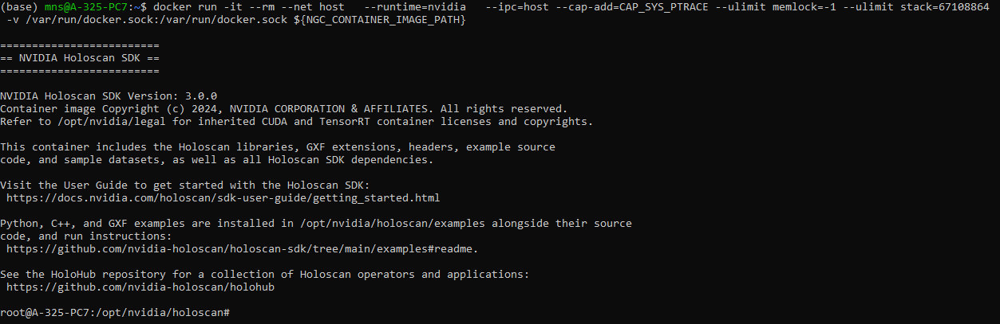
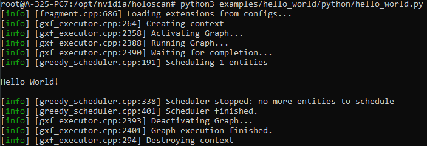

## **Prerequisites: Install Docker and NVIDIA Container Toolkit**

### **1. Install Docker on Ubuntu (WSL)**
First, ensure Docker is installed and running inside WSL:

```bash
sudo apt update
sudo apt install -y docker.io
```

Start and enable Docker:

```bash
sudo systemctl start docker
sudo systemctl enable docker
```

Add your user to the `docker` group (so you don’t need `sudo` to run Docker):

```bash
sudo usermod -aG docker $USER
```

> **Note**: Replace `$USER` with your actual username if needed, or use `$USER` for the current logged-in user. After running this command, log out and log back in, or run:
>
> ```bash
> newgrp docker
> ```
>
> This will apply the changes immediately without requiring a logout.

### **Step 2: Verify Docker Group Access**

Check that your user is in the Docker group:

```bash
groups
```

You should see `docker` listed among the groups.

### **Step 3: Test Docker Without `sudo`**

To verify Docker works without needing `sudo`, run the following:

```bash
docker run hello-world
```

If that works, you’re ready to proceed.

---

## **Step 4: Install NVIDIA Container Toolkit**

Now, install the NVIDIA Container Toolkit to enable GPU support in Docker containers.

1. **Add NVIDIA Container Toolkit repository:**

```bash
curl -fsSL https://nvidia.github.io/libnvidia-container/gpgkey | sudo gpg --dearmor -o /usr/share/keyrings/nvidia-container-toolkit-keyring.gpg \
  && curl -s -L https://nvidia.github.io/libnvidia-container/stable/deb/nvidia-container-toolkit.list | \
    sed 's#deb https://#deb [signed-by=/usr/share/keyrings/nvidia-container-toolkit-keyring.gpg] https://#g' | \
    sudo tee /etc/apt/sources.list.d/nvidia-container-toolkit.list
```

2. **Update package list and install the toolkit:**

```bash
sudo apt-get update
sudo apt-get install -y nvidia-container-toolkit
```

### **Step 5: Configure the Container Toolkit**

Run the following command to configure the container runtime for Docker:

```bash
sudo nvidia-ctk runtime configure --runtime=docker
```

This command will update the `/etc/docker/daemon.json` file to enable Docker to use the NVIDIA Container Runtime.

oficial documentation [NVidia Container Toolkit](https://docs.nvidia.com/datacenter/cloud-native/container-toolkit/latest/install-guide.html).

### **Step 6: Restart Docker Daemon**

Restart the Docker daemon to apply changes:

```bash
sudo systemctl restart docker
```

---

## **Step 7: Pull and Run the Container**

1. **Log in to the NGC Docker registry:**

>**Note**: login in [NVIDIA NGC](https://catalog.ngc.nvidia.com/) and get an Api key to enter a valid username and password

```bash
docker login nvcr.io
```

1. **Pull the Docker container image you need:**

Press the "Get Container" button on the [NGC website](https://catalog.ngc.nvidia.com/orgs/nvidia/teams/clara-holoscan/containers/holoscan) and choose the version you want to use, or run:

```bash
docker pull nvcr.io/nvidia/clara-holoscan/holoscan:v3.0.0-dgpu
```

3. **Set the container image path as an environment variable:**

```bash
export NGC_CONTAINER_IMAGE_PATH="nvcr.io/nvidia/clara-holoscan/holoscan:v3.0.0-dgpu"
```

4. **Run the container:**

You can start the container with the following command, including standard flags for GPU support:

```bash
docker run -it --rm --net host \
  --runtime=nvidia \
  --ipc=host --cap-add=CAP_SYS_PTRACE --ulimit memlock=-1 --ulimit stack=67108864 \
  -v /var/run/docker.sock:/var/run/docker.sock \
  ${NGC_CONTAINER_IMAGE_PATH}
```



---

## **Step 8: For Python Developers**

The `PYTHONPATH` is automatically set to include `/opt/nvidia/holoscan/python/lib`, so you can directly import `holoscan`:

```python
import holoscan
```

---

## **Step 9: Running Examples**

You can find Python, C++, and GXF examples in `/opt/nvidia/holoscan/examples`, along with the source code and instructions for running them.

For example, to run the Hello World Python example:

```bash
# Python
python3 /opt/nvidia/holoscan/examples/hello_world/python/hello_world.py
```


For more examples, visit the [Holoscan GitHub repository](https://github.com/nvidia-holoscan/holoscan-sdk/tree/main/examples#readme).

## **Step 10: Reinicio**

Para poder volver a usar Nvidia clara tendremos que re definir la exportación `export NGC_CONTAINER_IMAGE_PATH="nvcr.io/nvidia/clara-holoscan/holoscan:v3.0.0-dgpu"`

```Bash
docker run -it --rm --net host \
  --runtime=nvidia \
  --ipc=host --cap-add=CAP_SYS_PTRACE --ulimit memlock=-1 --ulimit stack=67108864 \
  -v /var/run/docker.sock:/var/run/docker.sock \
  ${NGC_CONTAINER_IMAGE_PATH}
```