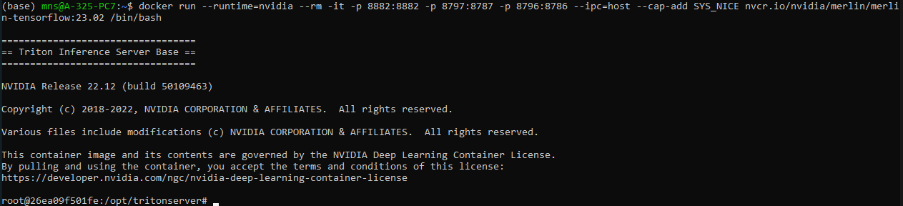

# Pre Installation

## Docker Image

Here, I started by installing Docker. However, if you already have the correct CUDA driver and CUDA toolkit versions installed on a workstation with GPUs, you will be able to pull the container and get started, without the need to install Docker, nvidia-docker-toolkit, and nvidia-toolkit.

### Steps for Docker Setup:

1. **Set up Docker** (if not already done).

2. **Pull the container image:**
```bash
   sudo docker pull nvcr.io/nvidia/merlin/merlin-tensorflow:23.02
```

1. **Install the NVIDIA container toolkit:**
   First, determine your distribution:
```bash
   distribution=$(. /etc/os-release;echo $ID$VERSION_ID)
```

   Then, run the following commands:
```bash
   curl -fsSL https://nvidia.github.io/libnvidia-container/gpgkey | sudo gpg --dearmor -o /usr/share/keyrings/nvidia-container-toolkit-keyring.gpg
   curl -s -L https://nvidia.github.io/libnvidia-container/$distribution/libnvidia-container.list | sed 's#deb https://#deb [signed-by=/usr/share/keyrings/nvidia-container-toolkit-keyring.gpg] https://#g' | sudo tee /etc/apt/sources.list.d/nvidia-container-toolkit.list
   sudo apt-get update
   sudo apt-get install -y nvidia-container-toolkit
   sudo apt-get install nvidia-container-runtime
```

1. **Configure NVIDIA runtime:**
```bash
   sudo nvidia-ctk runtime configure --runtime=docker
```

1. **Set up Docker to use NVIDIA runtime:**
   Create the directory and configuration files:
```bash
   sudo mkdir -p /etc/systemd/system/docker.service.d
   sudo tee /etc/systemd/system/docker.service.d/override.conf <<EOF
   [Service]
   ExecStart=
   ExecStart=/usr/bin/dockerd --host=fd:// --add-runtime=nvidia=/usr/bin/nvidia-container-runtime
   EOF
```

   Then, update the Docker daemon configuration:
```bash
   sudo nano /etc/docker/daemon.json
   {
       "runtimes": {
           "nvidia": {
               "Args": [],
               "path": "/usr/bin/nvidia-container-runtime",
               "default-runtime": "nvidia"
           }
       }
   }
```

1. **Restart Docker:**
```bash
   sudo pkill -SIGHUP dockerd
   sudo systemctl daemon-reload
   sudo systemctl restart docker
```

1. **Start Docker container:**
```bash
docker run --runtime=nvidia --rm -it -p 8882:8882 -p 8797:8787 -p 8796:8786 --ipc=host --cap-add SYS_NICE nvcr.io/nvidia/merlin/merlin-tensorflow:23.02 /bin/bash
```


## Reference
https://medium.com/google-developer-experts/setup-of-nvidia-merlin-and-tensorflow-for-recommendation-models-3a56f288f8aa